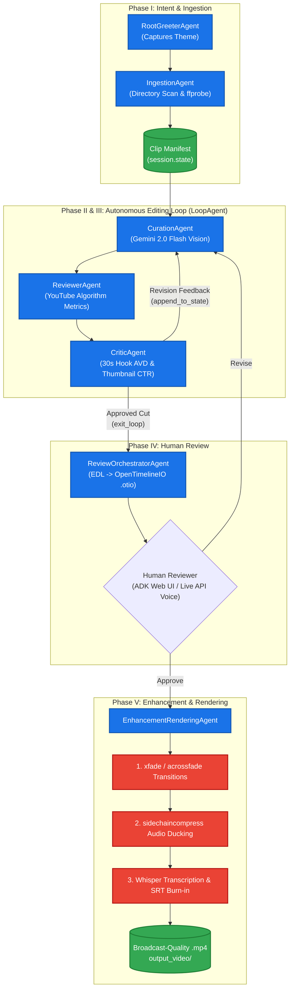

# VideoGuru 🎬

**Autonomous, Multi-Agent Video Production Pipeline powered by Google Agent Development Kit (ADK) & Gemini 2.0 Flash**

VideoGuru transforms raw, unedited video footage downloaded from Google Photos into broadcast-ready, YouTube-optimized vlogs. It leverages Google ADK multi-agent orchestration, multimodal generative vision, OpenTimelineIO interchange, automated FFmpeg transition rendering with audio ducking, and OpenAI Whisper subtitle burn-in — all guarded by a 4-tier security callback sandbox with human-in-the-loop approval.

---

## 🌟 Key Capabilities

1. **Zero-Touch Editing:** Automatically ingests local raw clips, probes AV stream metadata, evaluates visual interest and pacing, and curates a narrative timeline without manual NLE work.
2. **Autonomous AI Review Loop (`LoopAgent`):** An internal editorial board iterates the Edit Decision List (EDL):
   - **Curation Agent:** Selects engaging segment trims aligned with creator intent.
   - **Reviewer Agent:** Optimizes cuts against YouTube recommendation algorithms (cuts-per-minute, hook duration, retention drop-off).
   - **Critic Agent:** Evaluates human viewer psychology, first 30-second Average View Duration (AVD), and thumbnail Click-Through Rate (CTR) viability.
3. **Zero-Latency Human-in-the-Loop Review:** Converts approved cuts to universal OpenTimelineIO (`.otio`) format for inspection in DaVinci Resolve, Premiere Pro, or the ADK Web UI / Gemini Live streaming voice interface.
4. **Broadcast-Quality FFmpeg Post-Production:** Programmatically renders smooth video crossfades (`xfade`), audio crossfades (`acrossfade`), voice-activated audio ducking (`sidechaincompress`), and burned-in styled subtitles (`subtitles` filter).
5. **Four-Tier Security Sandboxing:** Uses ADK lifecycle callbacks to sanitize prompts, enforce binary/path whitelisting, intercept shell injection, and validate Pydantic output schemas.
6. **Graceful Degradation & Resilience:** External failures (Gemini quota, complex filter errors, Whisper GPU memory) seamlessly fall back to heuristic cuts, direct concatenation, and uncaptioned video with structured session warnings.

---

## 🏗️ Architecture Overview



---

## 👥 Agent Roster

| Agent | ADK Type | Key Responsibility | Tools & Output |
| :--- | :--- | :--- | :--- |
| **Root Greeter** | Entry Agent | Captures creator's narrative theme and highlights | `record_theme` → `session.state["theme"]` |
| **Ingestion Agent** | Sequential | Scans local media directory and extracts video streams | `scan_local_directory`, `extract_clip_metadata` → `session.state["clip_manifest"]` |
| **Curation Agent** | Loop Member | Analyzes footage using Gemini 2.0 Flash multimodal vision | `analyze_clip`, `assemble_edl_from_manifest` → `session.state["edl"]` |
| **Reviewer Agent** | Loop Member | Analyzes timeline pacing, retention curve, and hooks | `review_edl_algorithmically` (CPM, hook metrics) |
| **Critic Agent** | Loop Member | Evaluates 30s hook AVD, thumbnail CTR, and emotional resonance | `review_edl_as_critic` → invokes `exit_loop` or `append_to_state` |
| **Review Orchestrator** | Sequential | Generates OpenTimelineIO file and manages approval gates | `edl_to_otio`, `prepare_review_summary`, `process_user_review_response` |
| **Enhancement & Rendering** | Sequential | Executes FFmpeg rendering pipeline with audio polish and subtitles | `render_with_transitions`, `apply_audio_ducking`, `generate_captions` → `.mp4` |
| **Root Workflow Agent** | Sequential | Master pipeline orchestrator wiring all 5 subagents and security callbacks | `execute_pipeline`, `run_pipeline_async` |

---

## 🛡️ Security & Sandboxing (ADK Callbacks)

VideoGuru enforces a strict defense-in-depth model via Google ADK lifecycle callbacks:

| Callback | Hook Phase | Protection Mechanism |
| :--- | :--- | :--- |
| **`before_model_callback`** | Prior to LLM prompt submission | Regex engine blocks prompt injections, instruction overrides, sensitive files (`.env`, `id_rsa`), and external URL downloads. |
| **`before_tool_callback`** | Prior to tool execution | Binary whitelist (`ffmpeg`, `ffprobe`), argument flag inspection, path confinement to authorized media/staging/output directories, and shell injection blocking. |
| **`after_tool_callback`** | Immediately following tool return | Intercepts stderr/exit codes, classifies corrupt media, filter graph syntax, or codec mismatches, providing actionable LLM self-correction feedback and retry backoff. |
| **`after_model_callback`** | After LLM completion | Validates structured JSON against Pydantic `EditDecisionList` schemas and cross-checks clip duration limits against the manifest. |

---

## ⚙️ Prerequisites & Setup

### 1. System Requirements
- **Python:** 3.11 or higher
- **FFmpeg & FFprobe:** Installed and accessible on your system `PATH` (verify with `ffmpeg -version` and `ffprobe -version`)
- **OS:** Windows 10/11, macOS, or Linux

### 2. Installation
Clone the repository and install dependencies in a virtual environment:

```bash
git clone https://github.com/PankajDGupta/videoguru.git
cd videoguru

# Create and activate virtual environment
python -m venv .venv
# On Windows:
.venv\Scripts\activate
# On macOS/Linux:
source .venv/bin/activate

# Install project dependencies
pip install -r requirements.txt
```

### 3. Environment Configuration
Copy the `.env.example` file to `.env` and configure your API keys:

```bash
cp .env.example .env
```

Key configuration options in `.env`:

```ini
# Google Gemini API Key (Required for live multimodal analysis & LLM agents)
GEMINI_API_KEY=your_gemini_api_key_here

# Directory Paths
MEDIA_INPUT_DIR=input_videos
STAGING_DIR=staging
OUTPUT_DIR=output_video

# AI Models
GEMINI_MODEL=gemini-2.0-flash
WHISPER_MODEL=medium

# Autonomous Loop Safety Limit
MAX_LOOP_ITERATIONS=5

# Logging & Observability (SPEC-028)
LOG_LEVEL=INFO
LOG_JSON=true
# LOG_FILE=staging/videoguru.log
```

---

## 🚀 Usage Guide

### 1. Run the Full Pipeline End-to-End (`--pipeline`)
Execute the complete multi-agent workflow from intent capture to final `.mp4` render:

```bash
# Live mode with Gemini API
python main.py --pipeline --theme "Tokyo Travel Highlights" --input-dir input_videos

# Offline / Deterministic mode (no API key required)
python main.py --pipeline --theme "Nature Hike" --input-dir input_videos --offline --auto-approve
```

### 2. Launch the ADK Web UI (`--web`)
Interact with VideoGuru through Google ADK's built-in web interface:

```bash
python main.py --web --host 127.0.0.1 --port 8000
```
Open `http://127.0.0.1:8000` in your browser.

### 3. Modular CLI Commands

| Workflow Step | Command | Description |
| :--- | :--- | :--- |
| **Inspect Configuration** | `python main.py --info` | Displays project settings, directory mappings, and agent readiness. |
| **Scan Directory** | `python main.py --scan-dir input_videos` | Discovers media clips (`.mp4`, `.mov`, `.avi`, `.mkv`) and file sizes. |
| **Extract Metadata** | `python main.py --extract-metadata input_videos/clip1.mp4` | Runs `ffprobe` to extract resolution, FPS, duration, and codecs. |
| **Build Clip Manifest** | `python main.py --ingest-dir input_videos` | Ingests media folder and outputs structured `ClipManifestEntry` array. |
| **Analyze Clip (Vision)** | `python main.py --analyze-clip input_videos/clip1.mp4 --theme "Surfing"` | Multimodal Gemini 2.0 Flash clip curation with structured scoring. |
| **Curate EDL** | `python main.py --curate --theme "City Tour" --ingest-dir input_videos` | Assembles complete Edit Decision List from ingested manifest. |
| **Validate EDL JSON** | `python main.py --validate-edl work_dir/edl.json` | Validates timecode bounds, duration constraints, and clip mappings. |
| **Algorithmic Review** | `python main.py --review-edl work_dir/edl.json --theme "Vlog"` | Evaluates cut frequency, hook duration, and pacing metrics. |
| **Critic & Thumbnail** | `python main.py --critic work_dir/edl.json --theme "Vlog"` | Evaluates 30s hook AVD, thumbnail candidate frame, and CTR potential. |
| **Autonomous Loop** | `python main.py --loop input_videos --theme "Road Trip"` | Executes Curation → Reviewer → Critic loop until convergence. |
| **Export to OTIO** | `python main.py --to-otio work_dir/edl.json` | Converts EDL to OpenTimelineIO (`.otio`) format. |
| **Review Draft** | `python main.py --review-draft work_dir/edl.json` | Presents review summary and processes user approval or revisions. |
| **Voice Review** | `python main.py --live-review work_dir/edl.json --voice-file feedback.wav` | Gemini Live API bidirectional streaming voice review. |
| **Audio Ducking** | `python main.py --duck-audio staging/video.mp4 --music-file input_videos/music.mp3` | Sidechain compression audio ducking under dialogue. |
| **Whisper Captions** | `python main.py --generate-captions staging/video.mp4` | Generates `.srt` with Whisper AI and burns subtitles into video. |
| **Render EDL** | `python main.py --render-edl work_dir/edl.json --music-file input_videos/music.mp3` | Full Phase V rendering (transitions, ducking, subtitles). |

### 4. Logging & Observability Options
VideoGuru features structured JSON logging with standardized event loggers:

```bash
# Output JSON formatted logs for Datadog, CloudWatch, or ELK
python main.py --pipeline --theme "Vlog" --log-json --log-level DEBUG

# Human-readable formatted logs
python main.py --pipeline --theme "Vlog" --no-log-json --log-level INFO

# Write logs to a dedicated file
python main.py --pipeline --theme "Vlog" --log-file staging/pipeline.log
```

---

## 🧪 Testing & Verification

Run the comprehensive automated test suite (560+ tests):

```bash
# Run all unit and integration tests
pytest

# Run tests quietly with summary
pytest -q

# Run specific subsystem tests
pytest tests/test_observability.py -v
pytest tests/test_error_handling_degradation.py -v
pytest tests/test_e2e_pipeline.py -v
```

---

## 📁 Project Structure

```
videoguru/
├── agents/                  # ADK Agent definitions
│   ├── root_pipeline.py     # Master RootWorkflowAgent (SequentialAgent)
│   ├── root_greeter.py      # RootGreeterAgent (intent capture)
│   ├── ingestion.py         # IngestionAgent (scanning & metadata)
│   ├── loop_agent.py        # Autonomous LoopAgent factory
│   ├── curation.py          # CurationAgent (multimodal vision)
│   ├── reviewer.py          # ReviewerAgent (algorithmic metrics)
│   ├── critic.py            # CriticAgent (human-feel & thumbnails)
│   ├── review_orchestrator.py # ReviewOrchestratorAgent (OTIO & approval)
│   └── enhancement_rendering.py # EnhancementRenderingAgent (FFmpeg pipeline)
├── callbacks/               # ADK Security & Lifecycle Callbacks
│   ├── input_guardrail.py   # before_model_callback (prompt injection guard)
│   ├── tool_sandbox.py      # before_tool_callback (FFmpeg sandbox & flags)
│   ├── error_recovery.py    # after_tool_callback (error diagnosis & retry)
│   └── schema_validation.py # after_model_callback (EDL JSON schema guard)
├── config/                  # Configuration & Environment
│   └── settings.py          # Centralized settings & path resolution
├── context/                 # Architectural specifications & documentation
│   ├── project-overview.md  # Product definition & goals
│   ├── project_overview.md  # Original architectural framework
│   ├── spec_file.md         # 30-step development specification breakdown
│   ├── progress-tracker.md  # Implementation progress & spec status
│   └── project-architecture.md # Comprehensive architecture reference
├── rendering/               # Low-level FFmpeg wrappers
│   └── ffmpeg_builder.py    # Command construction with Windows path escaping
├── schemas/                 # Pydantic data schemas
│   ├── edl.py               # EDLEntry & EditDecisionList models
│   ├── media.py             # ClipManifestEntry & ScannedVideoFile models
│   ├── review.py            # Algorithmic review scores & metrics
│   ├── critic.py            # CriticReviewResult & ThumbnailCandidate
│   └── intent.py            # UserIntent schema
├── services/                # Cross-cutting application services
│   ├── exceptions.py        # Domain exception taxonomy (SPEC-029)
│   ├── resilience.py        # Safe execution & session warnings (SPEC-029)
│   ├── observability.py     # Structured JSON logging & events (SPEC-028)
│   ├── live_review.py       # Gemini Live API bidirectional streaming
│   └── session_service.py   # ADK InMemorySessionService manager
├── tests/                   # 30+ Unit & Integration Test Suites
├── tools/                   # Custom ADK Tools
│   ├── directory_scanner.py # Local folder media discovery
│   ├── clip_metadata.py     # ffprobe stream extraction
│   ├── video_analysis.py    # Gemini 2.0 Flash multimodal clip analysis
│   ├── curation_tools.py    # EDL assembly from manifest
│   ├── review_tools.py      # Algorithmic YouTube metrics
│   ├── critic_tools.py      # Human-centric hook & thumbnail analysis
│   ├── loop_tools.py        # exit_loop & append_to_state tools
│   ├── otio_converter.py    # OpenTimelineIO timeline creation
│   ├── transition_renderer.py # FFmpeg xfade & acrossfade rendering
│   ├── audio_ducking.py     # FFmpeg sidechaincompress ducking
│   └── whisper_captioning.py # Whisper AI transcription & burn-in
├── main.py                  # Primary CLI & Web UI application entry point
└── pyproject.toml           # Project metadata & dependency declarations
```

---

## 📜 License

This project is licensed under the Apache License 2.0.
