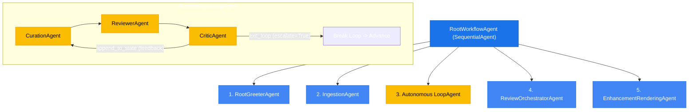
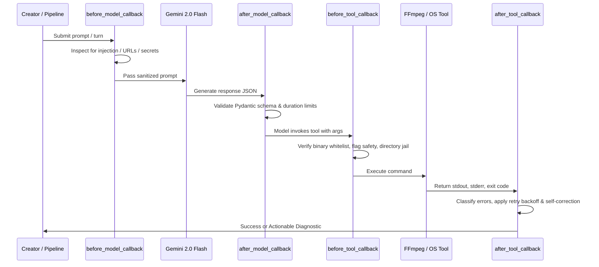

# VideoGuru — System Architecture & Developer Reference

> **Audience:** AI Agents, System Architects, and Software Engineers  
> **Status:** Production / 100% Implemented (Phases 0 through VIII)  
> **Last Updated:** 2026-09-07

---

## 1. System Overview & Core Philosophy

**VideoGuru** is a production-grade, automated multi-agent video production pipeline engineered on the **Google Agent Development Kit (ADK)** and powered by **Gemini 2.0 Flash** multimodal generative models.

The system ingests raw video footage (typically downloaded from Google Photos), extracts rich container and stream metadata, uses Gemini vision to analyze and score scenes against creator intent, refines the edit through an autonomous algorithmic/critic feedback loop, presents the draft to a human editor via OpenTimelineIO interchange, and renders a broadcast-quality final video complete with mathematical crossfades (`xfade`), audio ducking (`sidechaincompress`), and burned-in Whisper subtitles.

```
┌─────────────────┐
│ 1. Intent       │ ── Creator specifies theme / highlights
└────────┬────────┘
         ▼
┌─────────────────┐
│ 2. Ingestion    │ ── Scans directory, ffprobe stream extraction, Clip Manifest
└────────┬────────┘
         ▼
┌────────────────────────────────────────────────────────┐
│ 3. Autonomous AI Review Loop (ADK LoopAgent)           │
│    ├── Curation Agent   → Gemini 2.0 Flash multimodal  │
│    ├── Reviewer Agent   → YouTube algorithm metrics    │
│    └── Critic Agent     → 30s hook AVD & thumbnail CTR │
│        (loops until exit_loop or MAX_LOOP_ITERATIONS)  │
└────────┬───────────────────────────────────────────────┘
         ▼
┌─────────────────┐
│ 4. Human Review │ ── OpenTimelineIO (.otio) preview; Approve or Revise
└────────┬────────┘
         ▼
┌─────────────────┐
│ 5. Rendering    │ ── FFmpeg xfade, acrossfade, audio ducking, Whisper SRT
└────────┬────────┘
         ▼
┌─────────────────┐
│ 6. Output       │ ── Broadcast-quality 1080p @ 30fps .mp4 (output_video/)
└─────────────────┘
```

### Core Architectural Principles

1. **Deterministic Orchestration:** Agents use structured schemas (Pydantic models enforced via Gemini Structured Outputs) rather than unstructured text prompts to avoid pipeline drift.
2. **Local-Only Media Processing:** Heavy raw media bytes are processed locally via system FFmpeg/ffprobe binaries without uploading gigabytes of footage to cloud endpoints.
3. **Defense-in-Depth Callback Sandboxing:** Every model interaction and tool execution is intercepted by ADK lifecycle callbacks (`before_model`, `before_tool`, `after_tool`, `after_model`).
4. **Zero-Latency Editorial Interchange:** Review is performed via OpenTimelineIO proxy manifests rather than re-rendering heavy video passes between editorial iterations.
5. **Graceful Degradation:** External dependencies (Gemini API quota, Whisper CUDA memory, FFmpeg filter graph edge cases) degrade safely to deterministic heuristic cut fallbacks, direct cut concatenation, or uncaptioned video while logging structured session warnings.

---

## 2. Multi-Agent Orchestration Architecture

The system uses a hierarchical combination of ADK **`SequentialAgent`** and **`LoopAgent`** primitives:



### Agent Roster & Contracts

| Agent | Class | ADK Type | Input State | Primary Tools | Output State |
| :--- | :--- | :--- | :--- | :--- | :--- |
| **Root Greeter** | `RootGreeterAgent` | Entry | User prompt / message | `record_theme` | `session.state["theme"]` |
| **Ingestion** | `IngestionAgent` | Sequential | `session.state["theme"]`, `media_dir` | `scan_local_directory`, `extract_clip_metadata`, `build_clip_manifest` | `session.state["clip_manifest"]` |
| **Curation** | `CurationAgent` | Loop Member | `clip_manifest`, `theme`, `revision_feedback` | `analyze_clip`, `assemble_edl_from_manifest` | `session.state["edl"]` |
| **Reviewer** | `ReviewerAgent` | Loop Member | `edl`, `theme` | `review_edl_algorithmically` | `session.state["algorithmic_review"]` |
| **Critic** | `CriticAgent` | Loop Member | `edl`, `theme`, `clip_manifest` | `review_edl_as_critic`, `exit_loop`, `append_to_state` | `session.state["critic_review"]`, `session.state["candidate_thumbnail"]` |
| **Review Orchestrator**| `ReviewOrchestratorAgent` | Sequential | `edl`, `clip_manifest`, `theme` | `edl_to_otio`, `prepare_review_summary`, `process_user_review_response` | `session.state["otio_file_path"]`, `session.state["review_status"]` |
| **Enhancement & Rendering**| `EnhancementRenderingAgent` | Sequential | `edl`, `clip_manifest`, `music_path` | `render_with_transitions`, `apply_audio_ducking`, `generate_captions` | `session.state["final_video_path"]`, `session.state["rendering_complete"]` |
| **Root Workflow** | `RootWorkflowAgent` | Root Sequential | User prompt, initial state dict | Orchestrates all 5 subagents with ADK runner | Comprehensive execution summary dict |

### LoopAgent Mechanics & Convergence

The autonomous loop cycles `CurationAgent` → `ReviewerAgent` → `CriticAgent`:
1. `ReviewerAgent` computes algorithmic scores (pacing cadence, cuts-per-minute, hook duration).
2. `CriticAgent` computes human-centric metrics (30s Average View Duration potential, thumbnail viability, emotional storytelling).
3. If both pass thresholds (score ≥ 7.0, no dead air, strong hook), `CriticAgent` invokes ADK `exit_loop(tool_context)` with `escalate=True`, immediately terminating the loop.
4. If improvements are needed, `CriticAgent` invokes `append_to_state("revision_feedback", feedback, tool_context)`. The loop restarts, and `CurationAgent` adjusts trim ranges and transition intents to resolve the feedback.
5. **Safety Circuit Breaker:** `settings.MAX_LOOP_ITERATIONS` (default 5) prevents infinite cycling.

---

## 3. Session State Architecture & Data Contracts

State is stored in the ADK `InMemorySessionService` and accessed via `tool_context.state` or `session.state`.

### Session State Schema Progression

```
Session Initialization:
├── "theme": str (e.g. "Hiking Yosemite Highlights")
├── "media_dir": str (e.g. "input_videos")
└── "auto_approve": bool

Phase I (Ingestion):
└── "clip_manifest": list[dict] -> Serialized ClipManifestEntry objects

Phase II & III (Autonomous Loop):
├── "edl": list[dict] | EditDecisionList -> Serialized EDLEntry objects
├── "algorithmic_review": dict -> CPM, hook duration, retention scores
├── "critic_review": dict -> 30s hook metrics, storytelling score
├── "candidate_thumbnail": dict -> file_reference, timestamp, CTR score
├── "revision_feedback": list[str] -> Accumulated feedback per iteration
└── "loop_status": "exited" | "iterating"

Phase IV (Human Review):
├── "otio_file_path": str (path to staging/*.otio)
├── "review_status": "pending" | "approved" | "revise"
└── "user_review_feedback": Optional[str]

Phase V (Enhancement & Rendering):
├── "transition_rendered_path": str (path to step1_transitions.mp4)
├── "ducked_video_path": Optional[str] (path to step2_ducked.mp4)
├── "srt_path": Optional[str] (path to subtitles.srt)
├── "captioned_video_path": str (path to step3_captioned.mp4)
├── "final_video_path": str (path to output_video/final_vlog_*.mp4)
└── "rendering_complete": bool (True)

Cross-Cutting Resilience Keys:
├── "warnings": list[dict] -> Non-fatal degradation diagnostics
├── "error": Optional[str] -> Fatal or caught error message
└── "error_details": Optional[dict] -> Structured error payload
```

---

## 4. Key Pydantic Data Schemas

All core domain entities are defined with Pydantic v2 in `schemas/`:

### 1. `ClipManifestEntry` (`schemas/media.py`)
```python
class ClipManifestEntry(BaseModel):
    clip_id: str             # Deterministic UUID (e.g. vid_8f3a9b21)
    file_name: str           # Base file name
    absolute_path: str       # Normalized path on host OS
    duration_seconds: float  # Extracted via ffprobe format.duration
    frame_rate: float        # Normalized fps (e.g. 29.97, 30.0, 60.0)
    resolution: str          # WxH format (e.g. "1920x1080")
    width: int               # Frame width
    height: int              # Frame height
    video_codec: str         # e.g. "h264", "hevc"
    audio_codec: Optional[str] # e.g. "aac", or None if silent
    has_audio: bool          # True if audio stream exists
```

### 2. `EDLEntry` & `EditDecisionList` (`schemas/edl.py`)
```python
class TransitionIntent(str, Enum):
    CUT = "cut"
    FADE = "fade"
    WIPE = "wipe"
    SLIDE = "slide"
    DISSOLVE = "dissolve"

class EDLEntry(BaseModel):
    file_reference: str          # References clip_id
    start_trim: float            # Seconds >= 0.0
    end_trim: float              # Seconds > start_trim
    scene_rationale: str         # Editorial rationale
    transition_intent: TransitionIntent # Desired transition
    engagement_score: Optional[float]   # 0.0 - 10.0

class EditDecisionList(BaseModel):
    entries: list[EDLEntry]
```

### 3. Review & Critic Schemas (`schemas/review.py`, `schemas/critic.py`)
- `AlgorithmicReviewResult`: `pacing_score`, `hook_score`, `retention_score`, `cuts_per_minute`, `passed`.
- `CriticReviewResult`: `hook_30s_score`, `thumbnail_score`, `storytelling_score`, `candidate_thumbnail`, `loop_action`.

---

## 5. Rendering Engine & FFmpeg Filter Graph

Rendering is implemented in `rendering/ffmpeg_builder.py`, `tools/transition_renderer.py`, and `tools/audio_ducking.py`.

### 1. Two-Pass Transition Architecture
1. **Pre-trimming & Normalization Pass:**  
   Each cut is pre-trimmed and scaled/padded to `1920x1080 @ 30fps` with 48kHz stereo AAC audio into intermediate staging files:
   ```bash
   ffmpeg -y -ss <start> -to <end> -i <raw_clip> \
     -vf "scale=1920:1080:force_original_aspect_ratio=decrease,pad=1920:1080:(ow-iw)/2:(oh-ih)/2,fps=30" \
     -c:v libx264 -preset fast -c:a aac -ar 48000 -ac 2 <staged_cut.mp4>
   ```
2. **`filter_complex` xfade & acrossfade Chain:**  
   Dynamically calculates cumulative duration offsets:
   $$\text{offset}_{k} = \sum_{i=0}^{k} \text{duration}_i - (k + 1) \times \text{transition\_duration}$$
   Applies visual xfade and audio acrossfade filters in lockstep:
   ```
   [0:v][1:v]xfade=transition=fade:duration=1.0:offset=2.5[v01];
   [0:a][1:a]acrossfade=d=1.0[a01];
   [v01][2:v]xfade=transition=wipeleft:duration=1.0:offset=5.5[v02];
   [a01][2:a]acrossfade=d=1.0[a02]
   ```

### 2. Audio Ducking Pass
Applies FFmpeg `sidechaincompress` to duck background music when voice audio is present:
```bash
ffmpeg -y -i <video.mp4> -i <music.mp3> \
  -filter_complex "[1:a]volume=0.3[bgm];[bgm][0:a]sidechaincompress=threshold=0.08:ratio=4:attack=20:release=300[ducked];[0:a][ducked]amix=inputs=2:duration=first[outa]" \
  -map 0:v -map "[outa]" -c:v copy -c:a aac <ducked_video.mp4>
```

### 3. Whisper Subtitle Burn-In Pass
1. Extracts audio and executes OpenAI Whisper model (`transcribe_audio_whisper`).
2. Converts timestamped segments to SubRip `.srt` format (`write_srt_file`).
3. Burns subtitles permanently into video frames using FFmpeg's `subtitles` filter with Windows path colon escaping (`C\\:/...`).

---

## 6. Security Callback Architecture (ADK)

All agents and tools are wrapped by four enterprise-grade lifecycle callbacks (`callbacks/`):



1. **`before_model_callback` (`callbacks/input_guardrail.py`):**  
   Pre-inference regex engine scanning for system prompt overrides, remote payload downloads (`curl`, `wget`), and sensitive file access (`.env`, `id_rsa`).
2. **`before_tool_callback` (`callbacks/tool_sandbox.py`):**  
   Blocks dangerous shell characters (`;`, `&`, `|`, `` ` ``, `$()`), enforces permitted binary whitelist (`ffmpeg`, `ffprobe`), and jails file paths to `MEDIA_INPUT_DIR`, `STAGING_DIR`, and `OUTPUT_DIR`.
3. **`after_tool_callback` (`callbacks/error_recovery.py`):**  
   Traps stderr, classifies corrupt files, filter syntax errors, or codec errors, and formats structured error guidance for self-correction.
4. **`after_model_callback` (`callbacks/schema_validation.py`):**  
   Extracts JSON blocks and enforces strict validation against `EditDecisionList`.

---

## 7. Observability, Logging & Error Resilience

### Structured JSON Logging (`services/observability.py`)
- Standard Python `logging` with `JsonFormatter`.
- Emits single-line JSON records with timestamps, log levels, module, function, line, and structured `extra` payloads.
- Dedicated event loggers:
  - `log_agent_transition(from_agent, to_agent, session_id, ...)`
  - `log_tool_invocation(tool_name, status, duration_seconds, ...)`
  - `log_edl_iteration(iteration, cut_count, total_duration, score, passed, ...)`
  - `log_render_progress(stage, progress_percent, output_path, ...)`
- Configurable via `LOG_LEVEL` (DEBUG/INFO/WARNING/ERROR), `LOG_JSON` (true/false), and `LOG_FILE` (`staging/videoguru.log`).

### Graceful Degradation Strategies (`services/resilience.py`, `services/exceptions.py`)
- **Exception Hierarchy:** `VideoGuruError` → `IngestionError`, `GeminiApiError`, `RenderError`, `AudioDuckingError`, `WhisperError`.
- **Degradation Matrix:**
  | Subsystem | Failure Scenario | Graceful Fallback Strategy | User Impact |
  | :--- | :--- | :--- | :--- |
  | **Gemini Multimodal** | Quota exceeded / API timeout | Falls back to heuristic cut curation (`mock_clip_analysis`) | Pipeline continues; warning in session state |
  | **FFmpeg xfade** | Complex filter graph fails | Falls back to direct concatenation (`-f concat -c copy`) | Video produced without transitions; warning logged |
  | **Audio Ducking** | Corrupt music or missing audio | Bypasses ducking and retains original audio track | Video rendered with original audio mix |
  | **Whisper Captions** | GPU OOM or model load error | Bypasses subtitle burn-in pass | Video rendered without captions |

---

## 8. Directory Layout & Module Responsibilities

```
videoguru/
├── agents/                      # ADK multi-agent implementations
│   ├── root_pipeline.py         # RootWorkflowAgent (Sequential master workflow)
│   ├── root_greeter.py          # RootGreeterAgent (intent capture)
│   ├── ingestion.py             # IngestionAgent (scans folder & extracts metadata)
│   ├── loop_agent.py            # create_loop_agent factory
│   ├── curation.py              # CurationAgent (Gemini vision clip analysis)
│   ├── reviewer.py              # ReviewerAgent (YouTube algorithmic scoring)
│   ├── critic.py                # CriticAgent (AVD, thumbnail CTR, loop control)
│   ├── review_orchestrator.py   # ReviewOrchestratorAgent (OTIO presentation & approval)
│   └── enhancement_rendering.py # EnhancementRenderingAgent (FFmpeg rendering stages)
├── callbacks/                   # ADK 4-tier security callbacks
│   ├── input_guardrail.py       # before_model prompt sanitizer
│   ├── tool_sandbox.py          # before_tool FFmpeg security sandbox
│   ├── error_recovery.py        # after_tool error classification & retry
│   └── schema_validation.py     # after_model EDL JSON validator
├── config/                      # Application configuration
│   └── settings.py              # Centralized environment and settings manager
├── context/                     # Project specs & architectural knowledge base
│   ├── project-overview.md      # Product scope and goals
│   ├── project_overview.md      # Reference architecture document
│   ├── spec_file.md             # Complete 30-step specification breakdown
│   ├── progress-tracker.md      # Spec completion tracking (Phases 0 - VIII)
│   └── project-architecture.md  # (This document) Definitive architectural reference
├── rendering/                   # FFmpeg command builders
│   └── ffmpeg_builder.py        # Shell-safe argument construction & execution
├── schemas/                     # Pydantic domain models
│   ├── edl.py                   # EDLEntry & EditDecisionList
│   ├── media.py                 # ClipManifestEntry & ScannedVideoFile
│   ├── review.py                # Review metrics and result models
│   ├── critic.py                # Critic metrics and thumbnail candidate models
│   └── intent.py                # UserIntent model
├── services/                    # Shared system services
│   ├── exceptions.py            # VideoGuru domain exception taxonomy
│   ├── resilience.py            # Safe execution wrappers & session warnings
│   ├── observability.py         # Structured JSON logging & event loggers
│   ├── live_review.py           # Gemini Live API bidirectional streaming
│   └── session_service.py       # ADK InMemorySessionService singleton
├── tests/                       # 30+ Pytest unit and integration test suites
├── tools/                       # Custom ADK tool functions
│   ├── directory_scanner.py     # scan_local_directory
│   ├── clip_metadata.py         # extract_clip_metadata via ffprobe
│   ├── video_analysis.py        # analyze_clip via Gemini 2.0 Flash
│   ├── curation_tools.py        # assemble_edl_from_manifest
│   ├── review_tools.py          # review_edl_algorithmically
│   ├── critic_tools.py          # review_edl_as_critic
│   ├── loop_tools.py            # exit_loop & append_to_state
│   ├── otio_converter.py        # edl_to_otio OpenTimelineIO exporter
│   ├── transition_renderer.py   # render_with_transitions
│   ├── audio_ducking.py         # apply_audio_ducking
│   └── whisper_captioning.py    # generate_captions
├── main.py                      # CLI & Web UI entry point
├── README.md                    # User and operator onboarding guide
└── pyproject.toml               # Build metadata & dependency declarations
```

---

## 9. Developer & New Agent Guidelines

When modifying or extending VideoGuru:

1. **Always preserve schema contracts:** When adding attributes to `EDLEntry`, `ClipManifestEntry`, or review outputs, update Pydantic models in `schemas/` and keep validation rules synchronized.
2. **Never invoke `os.system` or raw shell commands:** Always use `subprocess.run()` via `rendering.ffmpeg_builder.execute_ffmpeg_command()`, which is verified by `before_tool_callback` path and argument sandboxing.
3. **Keep session state mutations explicit:** Subagents should read and write known keys to `tool_context.state` rather than holding state in ephemeral Python instance variables.
4. **Log with structured metadata:** Use `log_agent_transition`, `log_tool_invocation`, `log_edl_iteration`, and `log_render_progress` from `services.observability` to maintain end-to-end trace observability.
5. **Run the test suite:** Run `pytest -q` before and after modifying any component. Ensure all unit and integration tests pass without regression.
